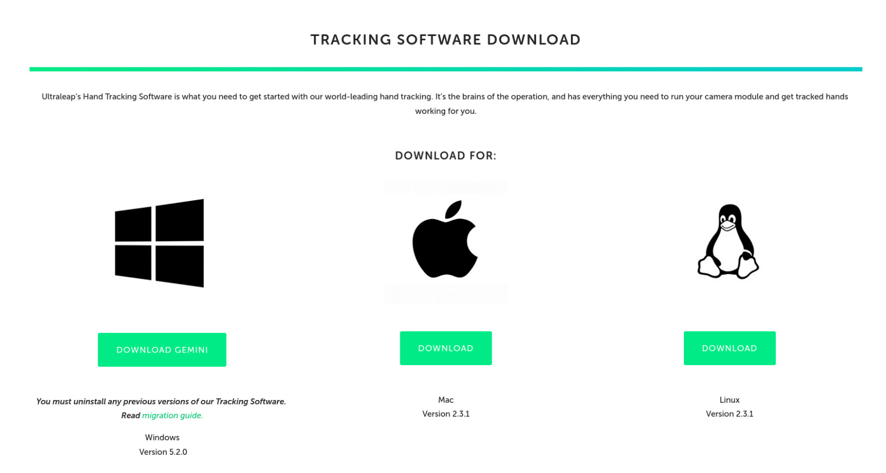
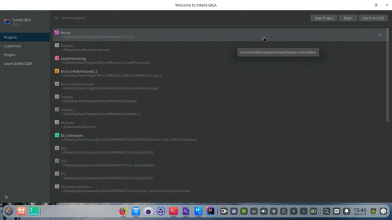

# LeapProcessing library

With this library we are going to manage the inputs that the [LeapMotion](https://www.ultraleap.com/product/leap-motion-controller/) gives us back by going to draw them with processing.

## Examples


## Tutorial

1. Install the [LeapMotion SDK](https://developer.leapmotion.com/tracking-software-download), choosing the OS you are using.
    

2. After extracting the file, install the .deb / .exe / .dmg program present in the downloaded folder
    

3. Create an IntelliJ idea project, following the steps in the video below

    #### This is the code used in the video

    ```java
    public class Principale extends PrincipaleProcessing{

        public static void main(String[] args){
            LeapProcessing lp = new LeapProcessing("Principale");

        }

        @Override
        public void addPAappletComponents() {
            //getHands()[0] is the right hand, getHands()[1] is the left hand.
            text(super.getHands()[0].getDataHand().getCoordPalmProcessing()[0]+"", 200, 200);
        }
    }
    ```

## API Reference


| Method Names                                    | Parameter | Returned Type | Description                |
| :---------------------------------------------- | :-------- | :------------ | :------------------------- |
|` super.getHands()`                              | `void`    | `HandLP[]`    | Returns an array of hands, where the first is the right and the second is the left.  |
|` HandLP.getDataHand().getPalm()`                | `void`    | `float[]`     | Returns the x, y, z coordinates of the palm of the hand |
|` HandLP.getDataHand().getCoordPalmProcessing()` | `void`    | `float[]`     | Returns the x, y, z coordinates based on Processing of the palm of the hand |
|` HandLP.getDataHand().getCoord_x()`             | `void`    | `float[][]`   | Returns the x coordinates of the bones of the fingers of the hand (starting from the thumb to the little finger) |
|` HandLP.getDataHand().getCoord_y()`             | `void`    | `float[][]`   | Returns the y coordinates of the bones of the fingers of the hand (starting from the thumb to the little finger) |
|` HandLP.getDataHand().getCoord_z()`             | `void`    | `float[][]`   | Returns the z coordinates of the bones of the fingers of the hand (starting from the thumb to the little finger) |
|` HandLP.getDataHand().getCoordXProcessing()`    | `void`    | `float[][]`   | Returns the x coordinates of Processing of the bones of the fingers of the hand (starting from the thumb to the little finger) |
|` HandLP.getDataHand().getCoordYProcessing()`    | `void`    | `float[][]`   | Returns the y coordinates of Processing of the bones of the fingers of the hand (starting from the thumb to the little finger) |
|` HandLP.getDataHand().getCoordZProcessing()`    | `void`    | `float[][]`   | Returns the z coordinates of Processing of the bones of the fingers of the hand (starting from the thumb to the little finger) |
|` HandLP.getDataHand().thumbIndexDistance()`     | `void`    | `float`       | Return the distance between the tip of the thumb and the tip of the index finger of the right hand. |

## Information

If the hands are not detected by the Leap, the functions for obtaining the coordinates of the points in processing will all return negative values (except the Z axis).

## Libraries used

- [Leap Motion](https://developer-archive.leapmotion.com/documentation/java/devguide/Leap_SDK_Overview.html)
- [Processing](https://processing.org/)

## Authors

- [@IsabellaBianco](https://github.com/IsabellaBianco)
- [@GabrieleFerrero](https://github.com/GabrieleFerrero)

  
